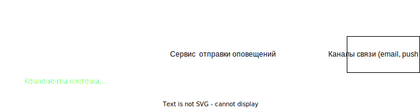

# Технический проект "Сервис отправки оповещений"

> Имеков Даши, 1 когорта
---

## Текущая архитектура

В текущей архитектуре у нас есть мобильное приложение, которое общается с компонентом "Controller", а он в свою очередь делает запросы к "Foo" и "Bar".

## Целевая архитектура

### Диаграмма контекста (C1):

Предполагается, что любой из существующих компонентов может отправить оповещение пользователю. При этом существующие каналы связи и предпочтения по их использованию известны системе оповещений, компоненты остальной системы знать это не должны.

### Диаграмма контекста (C2):

![[c2.svg]]

### Диаграмма контекста (C3):

![[c3.svg]]

## КРИТЕРИИ ОЦЕНКИ ПРОТОТИПА

1. **Надежность:**

 - **Доставка сообщений:** оценить насколько система обеспечивает надежную доставку оповещений без потерь или задержек.
 - **Отказоустойчивость:** проверить как система справляется с отказами в работе и как быстро восстанавливается после сбоев.
 
2. **Скорость и производительность:**

 - **Время доставки:** Оценить скорость доставки оповещений до конечных пользователей.
 - **Масштабируемость:** Проверить насколько система способна масштабироваться при увеличении нагрузки.
 
3. **Поддержка разных каналов:**
  
 - **Многоканальность:** Оценить, насколько система поддерживает разные каналы доставки, такие как SMS, электронная почта, мобильные уведомления и др.
  - **Персонализация сообщений:** Проверить, насколько система позволяет настраивать и персонализировать сообщения для конечных пользователей.
  
4. **Управление подписчиками:**

  - **Управление списками подписчиков:** Оценить возможности управления списками адресатов оповещений, включая добавление, удаление и обновление данных подписчиков.
  - **Уровни разрешений:** Проверить, насколько система поддерживает уровни разрешений и подписки на различные категории событий.
  
5. **Безопасность:**
 
  - **Шифрование данных:** Убедится, что данные в системе шифруются для защиты конфиденциальности информации.
 - **Аутентификация и авторизация:** Проверить, как обеспечивается контроль доступа к системе и возможность аутентификации отправителей и получателей.

6. **Слежение и аналитика:**
  
 - **Отчёты и метрики:** Оценить наличие инструментов для мониторинга и отслеживания статистики доставки сообщений, включая количество отправленных, прочитанных и отклонённых сообщений.
 - **Анализ результатов:** Проверить, насколько система позволяет анализировать эффективность оповещений и их воздействие на пользователей.

7. **Гибкость и настраиваемость:**
  
  - **Шаблоны сообщений:** Оценить, насколько система позволяет настраивать шаблоны оповещений.
  - **Интеграция с другими системами:** Проверить, насколько легко систему можно интегрировать с другими приложениями и системами.

8. **Согласованность и целостность сообщений:**
  
 - **Гарантии порядка сообщений:** Убедится, что система может обеспечить согласованный порядок доставки оповещений при необходимости.
 - **Целостность сообщений:** Проверить, что сообщения не теряются и не искажаются в процессе доставки.

9. **Стоимость:**
 
 - **Затраты на использование:** Оценить экономическую эффективность системы и соответствие бюджету проекта.

10. **Документация и поддержка:**

- **Доступность документации:** Убедится, что у системы есть достаточная документация для пользователя и администраторов.
 - **Поддержка и обновления:** Проверить доступность технической поддержки и регулярность выпуска обновлений.